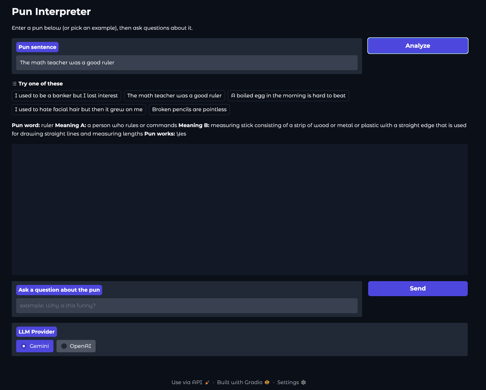
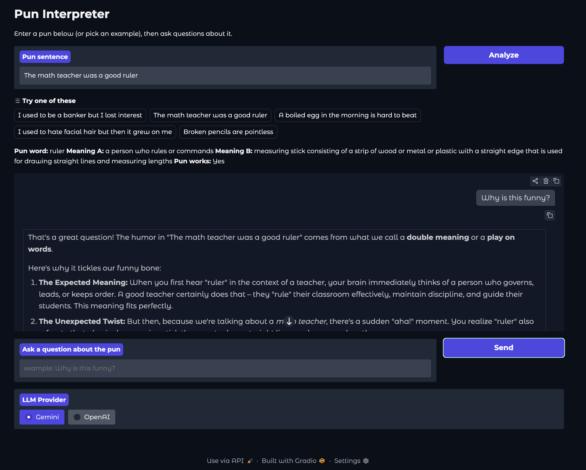

# Pun Dialog Interpreter

A conversational AI system that identifies pun words, explains the humor, and answers follow-up questions. Built with Python, SBERT, spaCy, WordNet, Gradio, and your choice of Google Gemini or OpenAI GPT.


 
## How It Works
 
1. Enter a pun or pick one of the examples
2. Click Analyze — the system identifies the pun word and its two meanings
3. Ask questions in the chat about why it's funny
4. Switch between Gemini and OpenAI using the toggle at the bottom



## Architecture 

When a user enters a pun, `sense_finder` tokenizes it with spaCy and looks up WordNet synsets for each noun, verb, and adjective. For each word, it uses SBERT to encode the sentence and all of that word's definitions, then scores them based on how well the top two meanings fit the sentence context and how semantically distant those meanings are from each other. The top 3 candidates get passed to `context_validator` which sends them to the LLM and asks it to pick the actual pun word and validate whether both meanings work. The result comes back as structured JSON and goes to `dialog_bot` which builds the conversation history and routes to whichever provider the user selected. The Gradio UI shows the analysis and opens the chat for follow-up questions. 

The LLM layer uses an abstract interface built with Python's ABC module. Gemini and OpenAI both implement the same `generate` and `chat` methods. Gemini converts the standard message format to its own format internally and OpenAI passes it through as is. Adding another provider just means implementing those two methods.

## Setup Instructions

### 1. Clone the repo
```bash
git clone https://github.com/shria01/pun-dialog-interpreter.git
cd pun-dialog-interpreter
```

### 2. Install dependencies
```bash
pip install -r src/dialog_bot/requirements.txt
```

### 3. Download the spaCy model
```bash
python -m spacy download en_core_web_sm
```

### 4. Setup NLTK (if needed)
```python
import nltk
nltk.download('wordnet')
nltk.download('omw-1.4')
nltk.download('punkt')
```

### 5. Set your API keys
```bash
export GEMINI_API_KEY="your-key-here"   # required default provider
export OPENAI_API_KEY="your-key-here"   # only needed if switching to OpenAI
```

Get an Gemini key at [aistudio.google.com](https://aistudio.google.com/apikey)

Get an OpenAI key at [platform.openai.com](https://platform.openai.com/api-keys)

### 6. Run the app
```bash
cd src/dialog_bot
python app.py
```
Then open the local URL printed in your terminal (usually http://127.0.0.1:7860).

## Examples to try
 
- "I used to be a banker but I lost interest"
- "The math teacher was a good ruler"
- "A boiled egg in the morning is hard to beat"
- "I used to hate facial hair but then it grew on me"
- "Broken pencils are pointless"

## Pun scoring
 
For each content word the sense_finder computes:
 
```
pun_score = avg(sense_a_similarity, sense_b_similarity) × semantic_distance
```
 
`sense_a_similarity` and `sense_b_similarity` are cosine similarities between the sentence embedding and the top two WordNet definitions. `semantic_distance` is how far apart those two definitions are from each other. The top 3 words by score get passed to the LLM, which makes the final call based on actual linguistic context.
 
**Known limitation:** WordNet indexes individual words, so phrasal verbs and idioms like "put down" or "give up" are partially missed — the idiomatic meaning doesn't exist on either word alone.
 

## My contributions
 
Co-authored the original pun scoring and WordNet-based detection as part of a Purdue group project, then in this fork extended it by:
- Built the `sense_finder` module — SBERT embeddings, POS-aware WordNet lookup, and the pun scoring formula
- Changed the detection approach to return top 3 candidates instead of one, so the LLM makes the final linguistic call rather than relying entirely on the score
- Refactored the LLM layer into an abstract provider interface so Gemini and OpenAI are swappable without changing anything else
- Added OpenAI support with runtime provider switching in the UI
- Updated `context_validator` so the LLM both selects the pun word and validates it, rather than only validating a pre-selected word
- Added retry logic and better JSON parsing for structured outputs

## Author
 
Shria Kondragunta — [github.com/shria01](https://github.com/shria01)
 
Original project: [ssuwaneh/Dialog-Pun-Interpreter-Group-10-NLP-Project](https://github.com/ssuwaneh/Dialog-Pun-Interpreter-Group-10-NLP-Project)
 
